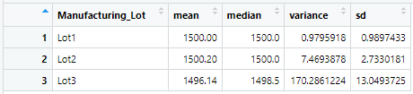

# MechaCar_Statistical_Analysis
Statistical Analysis with R

## Overview of the Analysis
### Purpose

xxx

### Resources

Data Sources: 
*     
* 

## Results

### Linear Regression to Predict MPG

* #### Linear Regression on MechaCar_mpg.csv

* #### Summary Statistics for p-value and r-squared values

xxx

### Summary Statistics on Suspension Coils 

* #### Summary Stats on Suspension_Coil.csv

* #### Summary Stats grouped by Manufacture Lot

xxx

### T-Tests on Suspension Coils 

* #### T-test on All Manufacturer Lots in Suspension_Coil.csv

* #### T-test on Manufacturer Lot 1

* #### T-test on Manufacturer Lot 2

* #### T-test on Manufacturer Lot 3

xxx
