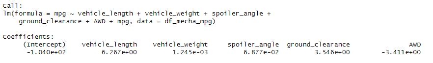
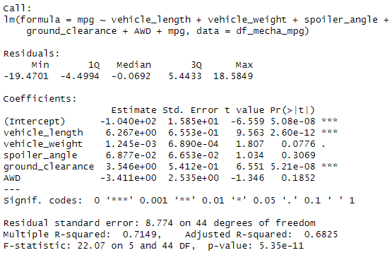
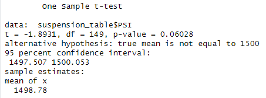
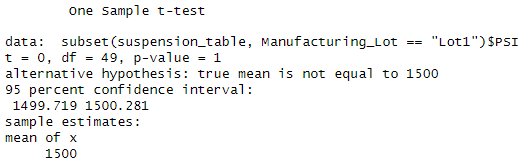
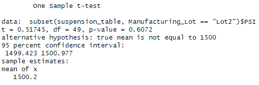
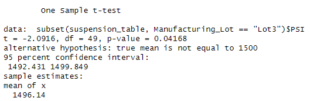

# MechaCar_Statistical_Analysis
Statistical Analysis with R

## Overview of the Analysis
### Purpose

xxx

### Resources

Data Sources: 
*     
* 

## Results

### Linear Regression to Predict MPG

* #### Linear Regression on MechaCar_mpg.csv

* #### Summary Statistics for p-value and r-squared values

* The variables that were the most significant and show a non-random amount of variance to the mpg values were `vehicle_length` and `ground_clearance`. The p-values for these variables were 2.60e-12 and 5.21e-8 respectively. These values are smaller than the standard of 0.05, meaning that the null hypothesis can be rejected and that both vehicle length and ground clearance have an impact on MechaCar’s mpg. 
* The p-value of the summary statistics was 5.35e-11. This is much smaller than the standard of 0.05, therefore the hypothesis that the slope is equal to zero must be rejected.  and not The slope of the linear regression model 
* By looking at the r-squared value and the above p-value we can see how accurate the model is at predicting mpg. The r-squared value is 0.7149 or about 71.5% accurate at predicting mpg of MechaCar. This linear model does seem to effectively predict mpg, however it could be better, especially for car production. 

### Summary Statistics on Suspension Coils 

* #### Summary Stats on Suspension_Coil.csv

* #### Summary Stats grouped by Manufacture Lot

* MechaCar has specifications that the variance in psi of the suspension coils must not exceed 100 psi.  The variance of suspension coils for MechaCar manufacturers as a whole was 62.29 psi, which meets the specification. However, when summary statistics were ran for each individual manufacturing lot, the variance of lot 3 did not meet the specification by a substantial seventy pounds per square inch. Lot 3’s variance was 170.29 psi. This value also significantly skewed the overall variance of psi for MechaCar lots as a whole, since both other lots had a variance of under eight psi.

### T-Tests on Suspension Coils 

1. #### T-test on All Manufacturer Lots in Suspension_Coil.csv

* The T-test results for suspension coils for all MechaCar lots shows that they are not statistically different from the true population mean of 1500 psi. The p-value was 0.060 which is above the common significance level of 0.05. The null hypothesis cannot be rejected.

2. #### T-test on Manufacturer Lot 1

* The T-test results for suspension coils for manufacturer lot 1 shows that they are not statistically different from the true population mean of 1500 psi. The p-value was 1.0 which is above the common significance level of 0.05. The null hypothesis cannot be rejected.

3. #### T-test on Manufacturer Lot 2

* The T-test results for suspension coils for manufacturer lot 2 shows that they are not statistically different from the true population mean of 1500 psi. The p-value was 0.607 which is above the common significance level of 0.05. The null hypothesis cannot be rejected.

4. #### T-test on Manufacturer Lot 3

* The T-test results for suspension coils for manufacturer lot 3 shows that the mean is not equal to the true population mean of 1500 psi. The p-value was 0.04168 which is below the common significance level of 0.05. The null hypothesis is rejected.
